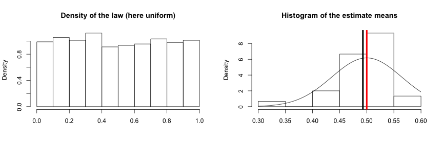

## Purpose of this data product

This visualization tool allows statistics students to understand interactively the two main statistic theorems: the `Law of Large Number` (LLN) and the `Central Limit Theorem` (CLT). It basically allows to :
- Chose one of those three continuous probabilistic laws : `Uniform`, `Exponential` and `Normal` and their corresponding parameters.
- Generate a number N of `samples` following the law.
- Plot a distribution of the law
- Plot an histogram of the empirical means
- Allows the user to display the estimate of the mean, the theoretical mean (LLN) and the asymptotic gaussian (CLT)

--- .class #id 

## Little reminder about LLN and CLT
- `Law of Large Number` :
We consider a sample of iid random variables $(X_i)_{1 \leq i \leq N}$ their mean $\mu$ and standard deviation $\sigma$. The sample average $\overline{X}_n = \frac{1}{n} (X_1 + \dots + X_n)$ converges to the expected value $\mu$.
- `Central Limit Theorem` :
The random variable $\overline{X}_n$ follows a normal distribution of mean $\mu$ and standard deviation $\sigma / \sqrt{n}$

---
## How to use the app
Here are the 5 steps you need to follow:
- Chose the size of your `sample` with the slider.
- Chose the type of distribution with the radio buttons.
- Set the `parameters` related to the distribution in the text fields.
- If you want, add the `theoretical mean`, the `estimate mean` or the `normal distribution`.
- Enjoy the two plots !

---
## Improvements that can be made
This project is all yours you can improve this app !

- `Quantify` the convergence

- Add other `laws` (for example discrete laws)

- Use other `visualation tools` (rCharts and googleVis)

